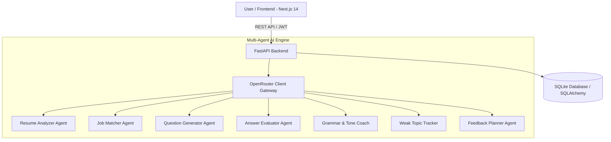

# 🎯 AI Interview Coach

An intelligent, multi-agent interview preparation platform that analyzes your resume against job descriptions, conducts personalized mock interviews, evaluates your responses in real-time, tracks weak topics, and builds custom study plans.

Powered by a coordinated **7-Agent AI System** via OpenRouter LLM APIs, with a modern **Next.js 14** frontend and high-performance **FastAPI** backend.

---

## ✨ Features

- 📄 **Resume & Job Matcher**: Upload PDF/DOCX resumes and input job descriptions to get instant match scores, skill overlap, and critical gaps.
- 🤖 **7-Agent Autonomous System**: Specialized AI agents work together to analyze resumes, generate context-aware questions, evaluate answers, analyze grammar/tone, and track candidate progress.
- 💬 **Interactive Mock Interviews**: Dynamic, real-time interview sessions tailored specifically to your target role and skill level.
- 📊 **Real-Time Answer Evaluation**: Get instant feedback on technical accuracy, clarity, structure, and professional tone after each question.
- 📈 **Weak Topic Tracking**: Continuous tracking of weak areas across interview sessions with adaptive question targeting.
- 🎯 **Analytics & Progress Dashboard**: Comprehensive visual analytics powered by Recharts, showing performance trends over time.
- 🔐 **Secure Authentication**: User authentication powered by JWT tokens and salted Bcrypt password hashing.

---

## 🏗️ System Architecture



### 🧠 The 7 AI Agents

1. **Resume Analyzer Agent**: Parses PDF/DOCX files, extracting key technical skills, experience levels, and project highlights.
2. **Job Matcher Agent**: Performs semantic comparison between candidate resumes and target job descriptions using **Claude 3.5/4.5 Sonnet**.
3. **Question Generator Agent**: Constructs adaptive technical, behavioral, and situational questions tailored to identified skill gaps.
4. **Answer Evaluator Agent**: Assesses answer quality, technical accuracy, completeness, and structure against scoring rubrics.
5. **Grammar & Tone Coach Agent**: Evaluates communication style, conciseness, confidence, and grammatical polish using **Claude 3.5/4.5 Haiku**.
6. **Weak Topic Tracker Agent**: Maintains long-term weakness maps for candidates and pushes targeted remediation questions.
7. **Feedback Planner Agent**: Synthesizes session performance into actionable, structured improvement plans.

---

## 🛠️ Tech Stack

### Frontend
- **Framework**: [Next.js 14](https://nextjs.org/) (App Router)
- **Library**: React 18
- **Language**: TypeScript (`^5.3.3`)
- **Styling**: Tailwind CSS (`^3.4.1`) & PostCSS
- **Components & Icons**: Lucide React, Recharts (Data Visualization), `clsx`, `tailwind-merge`

### Backend
- **Framework**: [FastAPI](https://fastapi.tiangolo.com/) (`>=0.109.0`)
- **Language**: Python 3.10+
- **Server**: Uvicorn (`>=0.27.0`)
- **Validation**: Pydantic v2 & `pydantic-settings`
- **Security**: PyJWT, Passlib (Bcrypt hashing)
- **Parsing**: `pdfplumber` (PDF), `python-docx` (Word Documents)

### Database & Storage
- **Database**: SQLite (`interview_coach.db`)
- **ORM**: SQLAlchemy 2.0 (`>=2.0.0`)

### AI / LLM Gateway
- **API Provider**: OpenRouter API (`httpx`)
- **Models**:
  - Claude 3.5/4.5 Sonnet (`anthropic/claude-sonnet-4.5`) - Matching & Analysis
  - Claude 3.5/4.5 Haiku (`anthropic/claude-haiku-4.5`) - Grammar & Tone Coaching
  - OpenRouter Auto (`openrouter/auto`) - Questions & Evaluation

---

## 🚀 Getting Started

### Prerequisites

- **Node.js**: v18.x or higher
- **Python**: v3.10 or higher
- **Git**
- **OpenRouter API Key** (Get one at [openrouter.ai](https://openrouter.ai/))

---

### 1. Environment Setup

Create a `.env` file in the root directory:

```env
OPENROUTER_API_KEY=your_openrouter_api_key_here
JWT_SECRET=supersecretjwtkey_ai_interview_coach_2026
DATABASE_URL=sqlite:///./interview_coach.db

# Model Configurations (Optional overrides)
OPENROUTER_QUESTION_MODEL=openrouter/auto
OPENROUTER_EVAL_MODEL=openrouter/auto
OPENROUTER_GRAMMAR_MODEL=anthropic/claude-haiku-4.5
OPENROUTER_MATCH_MODEL=anthropic/claude-sonnet-4.5
```

---

### 2. Backend Installation & Setup

```bash
# Navigate to backend directory
cd backend

# Create and activate virtual environment
python -m venv venv

# Windows PowerShell:
.\venv\Scripts\Activate.ps1
# Mac/Linux:
# source venv/bin/activate

# Install backend dependencies
pip install -r requirements.txt

# Run the FastAPI backend server
uvicorn app.main:app --reload --port 8001
```

The backend server will run at `http://127.0.0.1:8001`. You can access interactive Swagger docs at `http://127.0.0.1:8001/docs`.

---

### 3. Frontend Installation & Setup

Open a new terminal window:

```bash
# Navigate to frontend directory
cd frontend

# Install frontend dependencies
npm install

# Run the Next.js development server
npm run dev
```

The frontend application will be live at `http://localhost:3005`.

---

## 📂 Project Structure

```text
Interview agent/
├── backend/
│   ├── app/
│   │   ├── agents/            # 7 AI Agent implementations
│   │   │   ├── answer_evaluator.py
│   │   │   ├── feedback_planner.py
│   │   │   ├── grammar_coach.py
│   │   │   ├── interview_agent.py
│   │   │   ├── job_matcher.py
│   │   │   ├── openrouter_client.py
│   │   │   ├── question_generator.py
│   │   │   ├── resume_analyzer.py
│   │   │   └── weak_topic_tracker.py
│   │   ├── routers/           # FastAPI API Endpoints
│   │   │   ├── auth.py
│   │   │   ├── progress.py
│   │   │   ├── resume.py
│   │   │   └── session.py
│   │   ├── config.py          # Configuration & environment settings
│   │   ├── database.py        # SQLAlchemy engine & session setup
│   │   ├── deps.py            # Authentication & request dependencies
│   │   ├── main.py            # FastAPI app initialization & CORS
│   │   ├── models.py          # Database ORM models
│   │   ├── schemas.py         # Pydantic request/response schemas
│   │   └── security.py        # Password hashing & JWT helpers
│   └── requirements.txt
├── frontend/
│   ├── app/                   # Next.js App Router pages
│   │   ├── dashboard/         # Progress & Analytics Dashboard
│   │   ├── interview/[sessionId]/ # Interactive Interview Session
│   │   ├── login/             # Login Page
│   │   ├── results/[sessionId]/ # Detailed Session Results
│   │   ├── signup/            # Signup Page
│   │   ├── upload/            # Resume & Job Description Upload
│   │   ├── globals.css        # Tailwind styling & glassmorphism theme
│   │   ├── layout.tsx         # Root layout with Navbar wrapper
│   │   └── page.tsx           # Hero Landing Page
│   ├── components/            # Reusable UI components
│   └── package.json
├── .gitignore
└── README.md
```

---

## 📜 API Endpoint Summary

| Category | Method | Endpoint | Description |
| :--- | :--- | :--- | :--- |
| **Auth** | `POST` | `/auth/signup` | Register a new candidate account |
| **Auth** | `POST` | `/auth/login` | Authenticate user and receive JWT token |
| **Resume** | `POST` | `/resume/upload` | Upload resume (PDF/DOCX) & match with job description |
| **Session**| `POST` | `/session/start` | Initialize a new interactive interview session |
| **Session**| `POST` | `/session/submit-answer` | Submit answer for evaluation by AI agents |
| **Session**| `GET` | `/session/{id}` | Fetch session state, questions, and feedback |
| **Progress**| `GET` | `/progress` | Fetch analytics, weak topics, and score history |

---

## 🤝 Contributing

Contributions, issues, and feature requests are welcome! Feel free to check out the [issues page](https://github.com/manojkumar0605/Interview-Coach/issues).

---

## 📄 License

This project is licensed under the [MIT License](LICENSE).
